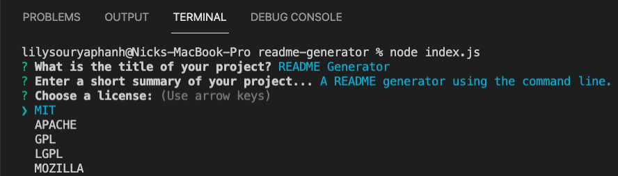

# README Generator

> Create a quick and simple README template using the command line to enter details of your project.
> Demo [_here_](https://watch.screencastify.com/v/ePabC3FrDKnBzE7CqOgI).

## Table of Contents

- [General Info](#general-information)
- [Technologies Used](#technologies-used)
- [Screenshots](#screenshots)
- [Setup](#setup)
- [Usage](#usage)
- [Contact](#contact)
- [License](#license)

## General Information

- A README generator using the command line to enter details of your project.
- Basic README template is created from the answers to the questions prompted by the command line.
- Once README has been created you can edit it as your project progresses.

## Technologies Used

- JavaScript
- [Node.js](https://nodejs.org/en/download/)
- npm

## Screenshots



## Setup

Using the command line, run the following from the root of the project:

```
npm install
```

## Usage

This project uses inquirer.js as the command line interface. To start building the README file type the following into the command line:

```
node index.js
```

You will be prompted with basic questions about your project. Follow through until the end and you will find a new file generated in the folder called README.md. You can then edit the file as your project progresses or changes. Make sure to add screenshots/gifs of your final project at the end.

## Contact

Created by [@lilyso](https://github.com/lilyso/) - feel free to contact me in regards to contributions or if you have any questions.

## License

This project is open source and available under the [MIT](https://opensource.org/licenses/MIT) license.
